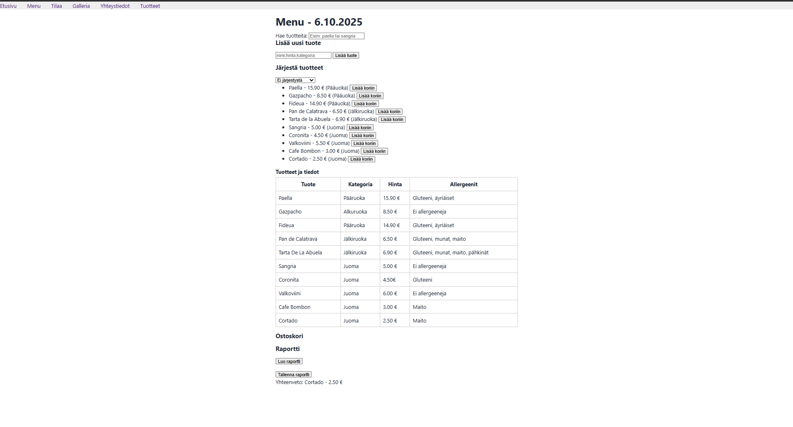
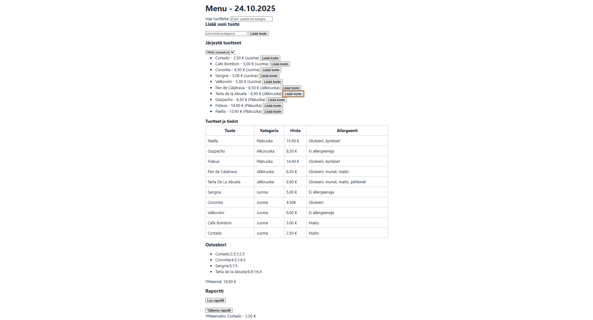

# ☕ Kahvila Tilaukset - Viikko 5

Tässä projektissa toteutin interaktiivisen kahvilasivun JavaScriptin avulla.

## 1. 📒 Dynaaminen Menu
- Käytin `map()` ja `join()` rakenteita ruokalistan renderöintiin.
- Jokaiselle tuotteelle lisätään "Lisä koriin" -painike.

## 2. 🔍 Haku ja Korostus
- Hakukenttä suodattaa tuotteita `include()` -menetelmällä.
- Hakusana korostetaan `RegExp`-pohjaisella `<mark>`-elementillä.

## 3. ➕ CSV-tyylinen Tuotelisäys 
- Käyttäjä voi lisätä tuotteita muodossa `nimi;hinta;kategoria`.
- Syöte validoidaan ennen lisäystä.

## 4. 🛒 Ostoskori
- Ostoskori näyttää tuotteiden määrän ja kokonaishinnan.

## 5. 💾 Raportti ja Tallennus
- Raportti generoidaan `map()` ja `join()` avulla.
- Käyttäjä voi tallentaa `.txt`-tiedostona `Blob`-objektin avulla.

## 💾 Kuvakaappaus

# ☕ Kahvila Tilaukset – Viikko 6

## 🔧 Rakenteen uudistus
- Erilliset luokat: `MenuItem`, `Drink`, `Food`, `CartItem`, `Order`, `MenuService`, `Currency`, `ValidationError`.

## 1. 📒 Dynaaminen Menu
- `MenuService`, `list()`, `search()` ja `sortBy()` -metodit.
- `renderMenu()`
- Jokaiselle lisätään "Lisää koriin" -painike

## 2. 🔍 Haku ja Järjestäminen
- Hakukenttä suodattaa tuotteita `menuService.search(haku)`-kutsulla.
- Tuotteet voidaan järjestää nimen tai hinnan mukaan.
- Hakusana korostetaan `<mark>`-elementillä.

## 3. ➕ CSV-tyylinen Tuotelisäys
- Käyttäjä voi lisätä tuotteita muodossa `nimi;hinta;kategoria`.
- `menuService.addFromCsv()` luo oikean olion (`Drink` tai `Food`) ja validoi syötteen.
- Virhetilanteissa näytetään `ValidationError`-viesti.

## 4. 🛒 Ostoskori
- `Order`-luokka hallinnoi ostoskorin sisältöä.
- `order.add(item)` lisää tuotteen koriin.
- `order.toReportLines()` ja `order.total` tuottavat raportin ja kokonaishinnan.

## 5. 💾 Raportti ja Tallennus
- Raportti generoidaan `menuService.list()`-kutsulla.
- Hinnat muotoillaan `Currency.formatEUR()`-metodilla.
- Käyttäjä voi tallentaa raportin `.txt`-tiedostona `Blob`-objektin avulla.

## 🎨 Ulkoasu ja Responsiivisuus
- Kaikki kuvat on rajattu `aspect-ratio`-pohjaisella `.image-wrapper`-tyylillä.
- Sivusto toimii eri ruutukoilla ja tukee korostuksia, piilotuksia ja lomakevalidointia.

## 📸 Kuvakaappaus
